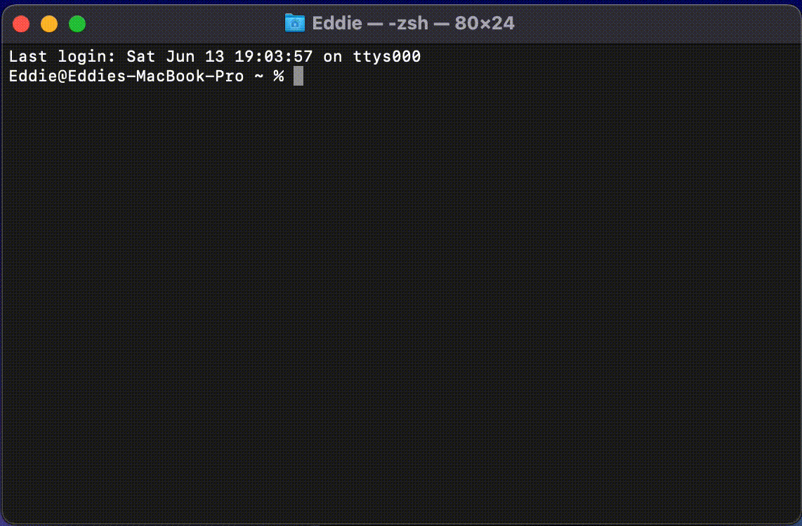

# macos-clear
Make the MacOS clear command actually nice... do a full clear with absolutely no scrollback!

Simply download and open [setup.sh](setup.sh) to set it up... then you're all set!

## Demo:

